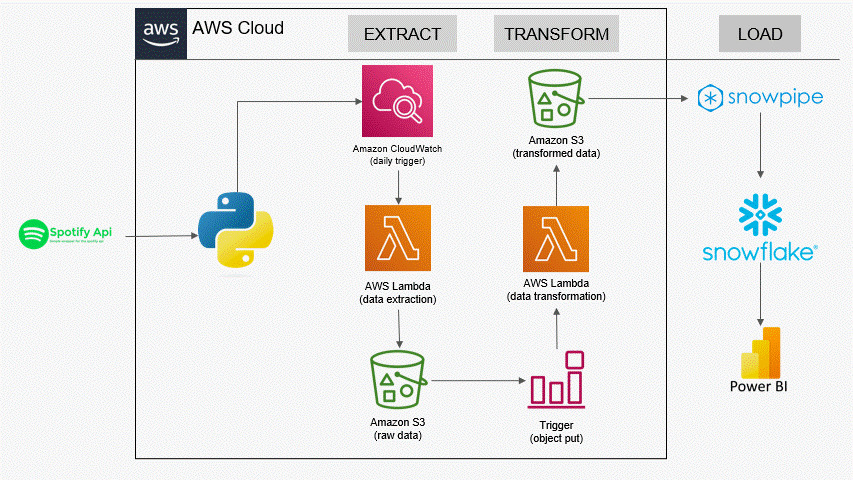

# Spotify-Data-Pipeline-with-Snowflake-Integration

## 🌟 Project Overview
This project extends a sophisticated data pipeline for integrating Spotify's music streaming data into Snowflake using AWS services. Designed to automate the collection, transformation, and analysis of massive datasets, the pipeline serves as a robust framework for scalable data handling in a cloud environment.

### Key Features
- **Automated Data Extraction**: Leverages AWS Lambda to fetch data from the Spotify API, scheduled via Amazon CloudWatch.
- **Efficient Data Transformation**: Utilizes AWS Lambda for data processing and AWS Glue for data orchestration.
- **Seamless Integration with Snowflake**: Employs Snowpipe for continuous data loading into Snowflake, supporting dynamic data warehousing needs.
- **Advanced Analytics**: Facilitates complex SQL querying in Snowflake and visualization in Power BI for enhanced decision-making.

## 📚 Reflection
This pipeline demonstrates a seamless integration of cloud services and data warehousing technologies to optimize data workflows in the cloud, enabling scalable and cost-effective solutions for big data analytics.

## 🚀 Methodology
- **Data Extraction**: Utilizes Lambda functions, triggered daily by CloudWatch, to retrieve and store data in Amazon S3.
- **Data Transformation**: Processes data through AWS Lambda, followed by data formatting and enrichment in AWS Glue.
- **Data Loading**: Automatically loads processed data into Snowflake using Snowpipe, ready for analysis.
- **Data Analysis**: Queries are run in Snowflake, with results visualized in Power BI to uncover insights.

## 📌 Architecture Diagram

## 📝 Lessons Learned
- Mastered the integration of AWS with Snowflake to streamline data workflows.
- Gained expertise in serverless architectures for efficient data management.
- Developed robust solutions for real-time data processing and reporting.

## 🛠️ Tools Used
| AWS Service      | Purpose                                              |
|------------------|------------------------------------------------------|
| Spotify API      | Provides the raw data for music streaming activities.|
| AWS Lambda       | Handles data extraction and transformation.          |
| Amazon S3        | Stores raw and processed data.                       |
| AWS Glue         | Manages data cataloging and transformation.          |
| Snowpipe         | Loads data into Snowflake efficiently.               |
| Snowflake        | Serves as the data warehouse for analytics.          |
| Power BI         | Visualizes data for business intelligence.           |

## 📂 How to Run
1. **Configure AWS Services**: Set up Lambda, S3, Glue, and CloudWatch to manage the data flow.
2. **Deploy Lambda Functions**: Implement the functions for data extraction and transformation.
3. **Setup Snowpipe**: Configure Snowpipe to load transformed data into Snowflake.
4. **Initiate Data Analysis**: Start querying in Snowflake and set up dashboards in Power BI.

## 🔮 Future Enhancements
- **Incorporate More Data Sources**: Extend the pipeline to include data from other music streaming platforms like YouTube and Apple Music.
- **Enable Real-Time Analytics**: Utilize AWS Kinesis for streaming data processing.
- **Enhance Visualizations**: Integrate with more advanced BI tools to improve data visualization capabilities.

## 📜 References
- [AWS Documentation](https://docs.aws.amazon.com)
- [Spotify API Documentation](https://developer.spotify.com)
- [Snowflake Documentation](https://docs.snowflake.com)
